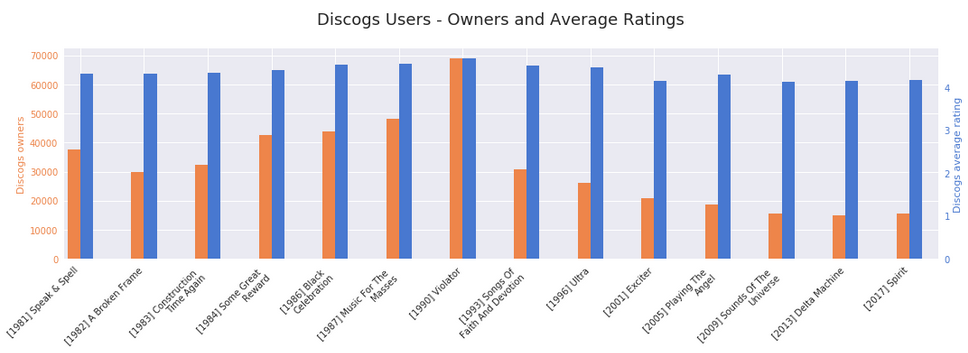
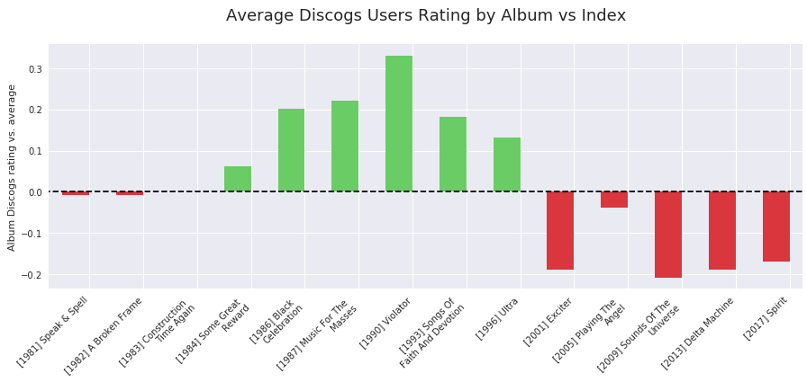
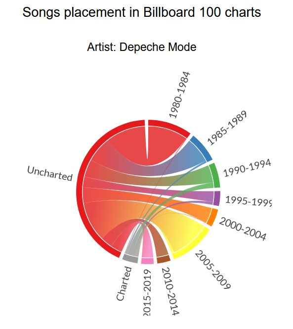

# Project_Santos

<strong>Santos Lyrics Analyser</strong> is a Jupyter Notebook based interface downloading and visualizing music artists discography data, statistics and lyrics sentiment

## High level overview:

For any given musician/band name:  
   - retrieves the discography of studio albums,  
   - allows user to select albums from a list, then retrieves lyrics for songs on selected albums, 
   - collects data such as owners and album ratings from DISCOGS.COM, album and song placement in official Billboard music charts, 
   - performs lyrics sentiment analysis and generates scores,  
   - with a simple user interface, allows users to browse a number of visalisations (by user defined period intervals where applicable). 
   
<h3> Example visualisations: </h3> 
      • number of songs and albums over time [Artist: David Bowie]    
      
 
      • word clouds by album or period   
      • lexical diversity over time [Artist: David Bowie]   
      
       
      • Discogs album ratings and statistics [Artist: Depeche Mode] 
      
 
 
 
 
      • success of tracks and albums in Billboard charts over time 

 
      • lyrics sentiment over time  
      • success in Billboard charts vs lyrics sentiment  
   

## Dependencies:

<h5><i>APIs and web scraping</i></h5>
lyricsgenius 
lxml.html 
cssselect 
discogs_client 
requests 
lyricsmaster 

<h5><u><i>data processing and charts</i></u></h5>
matplotlib 
pandas 
numpy 
time 
seaborn 
fuzzy_pandas 
chord 

<h5><u><i>UI</i></u></h5>
ipywidgets 
IPython 
tqdm 

<h5><u><i>word processing</i></u></h5>
re 
os 
nltk 
string 
wordcloud 
